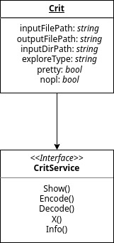
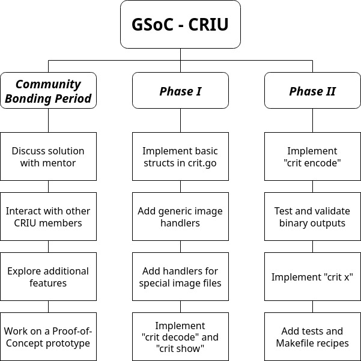

# Porting CRIU Image Tool (CRIT) to Go

**Mentors**: [Radostin Stoyanov](mailto:rstoyanov@fedoraproject.org), [Alexander Mikhalitsyn](mailto:alexander.mikhalitsyn@virtuozzo.com)

## Table of Contents

1. **[Abstract](#1-abstract)**
2. **[Technical details](#2-technical-details)**
	2.1. [CRIU image types and formats](#21-criu-image-types-and-formats)
	&nbsp;&nbsp;&nbsp;&nbsp;2.1.1. *[Protobuf image files](#211-protobuf-image-files)*
	&nbsp;&nbsp;&nbsp;&nbsp;2.1.2. *[Memory dump files](#212-memory-dump-files)*
	&nbsp;&nbsp;&nbsp;&nbsp;2.1.3. *[Raw image files](#213-raw-image-files)*
3. **[Implementation](#3-implementation)**
	3.1. [Image parsing](#31-image-parsing)
	&nbsp;&nbsp;&nbsp;&nbsp;3.1.1. *[Binary to JSON](#311-binary-to-json)*
	&nbsp;&nbsp;&nbsp;&nbsp;3.1.2. *[JSON to binary](#312-json-to-binary)*
	3.2. [CRIT CLI app](#32-crit-cli-app)
	3.3. [Protobuf files](#33-protobuf-files)
4. **[Timeline](#4-timeline)**
	4.1. [Before May 20](#41-before-may-20)
	4.2. [May 20 - June 12 (Community Bonding Period)](#42-may-20---june-12-community-bonding-period)
	4.3. [June 13 - July 24 (Phase I)](#43-june-13---july-24-phase-i)
	4.4. [July 25 - Sep 11 (Phase II)](#44-july-25---sep-11-phase-ii)
	4.5. [After Sep 20](#45-after-sep-20)
5. **[Personal information](#5-personal-information)**
	5.1. [About me](#51-about-me)
	5.2. [Open source activity](#52-open-source-activity)
	5.3. [Commitments during GSoC 2022](#53-commitments-during-gsoc-2022)

<br style="line-height:14" />

## 1. Abstract

CRIU provides a Python-based tool called ***CRIT*** in order to explore and manipulate checkpoint images. To enable hassle-free integration with Go projects, it is necessary to provide Go bindings for performing ***read/write/encode/decode*** operations on the image files. This project aims to extend the [go-criu](https://github.com/checkpoint-restore/go-criu) library to perform all image-based operations that CRIT is currently used for, both as an ***import-and-use*** dependency as well as a ***standalone CLI application*** like `crit`.

This solution is expected to ***provide native bindings*** in Go for all CRIU image manipulations, allowing Go projects that use CRIU to perform better analysis and testing on checkpoint images without setting up any additional infrastructure to create an RPC connection with CRIU. It also attempts to provide a ***more extensible implementation*** of the current CLI implementation of CRIT.

## 2. Technical Details

### 2.1. CRIU image types and formats

Currently, CRIU images are of three types:

- CRIU-specific files stored in the protobuf format
- Memory dump files
- Raw image files

#### 2.1.1. Protobuf image files

These files follow a standard defined format for storing data. Every file begins with ***two 4-byte entries***, also called as ***magic cookies***. The first entry contains the ***type of the image***. The second entry is optional, and contains the ***sub-type of the image***. This is followed by ***zero or more pairs*** of values - a 4-byte entry containing the ***size of the payload***, followed by ***the payload*** itself. Optionally, each of these pairs may be followed by ***extra payload***, depending on the entry type. The binary image data is organised as follows:

| Data                     | Size (bytes)        |
|--------------------------|---------------------|
| Magic                    | 4                   |
| Magic2 (optional)        | 4                   |
| Size0                    | 4                   |
| Payload0                 | Size0               |
| ExtraPayload0 (optional) | Depends on Payload0 |
| ...                      | ...                 |
| SizeN                    | 4                   |
| PayloadN                 | SizeN               |

This data can easily be parsed into a structure that looks like below:

```
{
	"magic": "FOO",
	"magic-2": "BAR", // optional
	"data": [
		{
			"payload": "BAZ",
			"extra-payload": "QUX" //optional
		}
		... // any number of pairs like above
	]
}
```

#### 2.1.2. Memory dump files

These files are of two types - ***pagemap***, and ***pages***. The pagemap file contains a list of pairs - the ***memory location*** of the data, followed by the ***number of pages***. The pages file contains a set of 4-kilobyte entries, each of which is a full page.

#### 2.1.3. Raw image files

These images contain data collected by CRIU with the help of external tools. They are handled by the respective tools that generated them, and do not require any additional implementation in CRIT.

<br style="line-height:6" />

## 3. Implementation

The basic library will consist of standalone files for each of the operations provided by CRIT. By leveraging the concept of interfaces in Go, a ***common worker agent*** will be able to call all operation functions. This interface can simply be extended in the future to add new functionalities to CRIT.



Partial work on the `encode` and `decode` operations has already been done in [this PR](https://github.com/checkpoint-restore/go-criu/pull/28), which can be utilised to an extent in this implementation. All interface functions will be ***exportable*** so that they can be called through imports. The structure of the code is as follows:

```go
// crit.go
type Crit struct {
	inputFilePath string
	outputFilePath string
	inputDirPath string
	exploreType string
	pretty bool
	nopl bool
}

type CritService interface {
	Show()
	Encode()
	Decode()
	X()
	Info()
}

func New(
	inputFilePath, outputFilePath,
	inputDirPath, exploreType string,
	pretty, nopl bool
) *CritService {
	return &Crit{
		inputFilePath: inputFilePath,
		outputFilePath: outputFilePath,
		inputDirPath: inputDirPath,
		exploreType: exploreType,
		pretty: pretty,
		nopl: nopl,
	}
}
```

### 3.1. Image parsing

The structs required to process a CRIU image within Go will be provided in an `image.go` file. All struct members will possess a ***JSON tag*** to enable marshaling and unmarshaling. The protobuf payloads will be stored in a separate struct as some image files may contain extra payloads which can be stored along with the parent payload, allowing for a more uniform organisation of data. The structure of the code is as follows:

```go
// image.go
type JsonImage struct {
	Magic string `json:"magic"`
	Magic2 string `json:"magic2"`
	Data []ProtoData `json:"data"`
}

type ProtoData struct {
	Payload string `json:"payload"`
	ExtraPayload string `json:"extraPayload"`
}
```

#### 3.1.1. Binary to JSON

Go natively provides a byte data type, using which the binary image can directly be read as a ***byte stream***. Since the magic and the payload sizes are known to be 4 bytes, the byte stream is processed 4 bytes at a time into a buffer until the size of the first payload is obtained, and then the payload itself is processed. This is looped until the end of the file is reached, after which the data is encoded into JSON and written to the output file. As a fallback, if no output file is provided, the data will be written to `stdout`, rather than failing the command. The general logic is as follows:

```go
// decode.go
func (c *Crit) Decode() {
	img := JsonImage{}
	f, err := os.Open(c.inputFilePath)
	if err != nil {
		fmt.Println("Error opening image file: ", err)
		return
	}
	defer f.Close()

	buf := make([]byte, 4)
	// read magic
	_, err = f.Read(buf)
	// decode and identify magic
	img.Magic = decodeMagic(buf)
	// read image contents until EOF
	for {
		bytes, err := f.Read(buf)
		if bytes == 0 {
			if err == io.EOF {
				break
			}
			fmt.Println("Error parsing bytes: ", err)
			f.Close()
			return
		}
		payloadSize := uint64(binary.LittleEndian.Uint32(buf))
		payloadBuf := make([]byte, payloadSize)
		_, err = f.Read(payloadBuf)
		if err != nil {
			fmt.Println("Failed to read payload: ", err)
			f.Close()
			return
		}
		// decode protobuf information into ProtoData struct type
		protoData := decodeProto(payloadBuf)
		img.Data = append(img.Data, protoData)
	}
	// format img into pretty JSON and output
	...
}
```

#### 3.1.2. JSON to binary

The JSON data can be unmarshaled into a `JsonImage` struct object, and written to binary directly as a byte stream. Since binary data is ***not human readable***, writing to `stdout` is not a viable option. It makes sense for the command to throw an error if an output file path is not provided.

```go
// encode.go
func (c *Crit) Encode() {
	json, err := os.ReadFile(c.inputFilePath)
	if err != nil {
		fmt.Println("Error reading JSON file: ", err)
		return
	}
	f, err := os.OpenFile(c.outputFilePath, os.O_WRONLY|os.O_CREATE, 0o644)
	if err != nil {
		fmt.Println("Error creating image file: ", err)
		return
	}

	img := JsonImage{}
	buf := make([]byte, 4)
	// encode magic
	magic := encodeMagic(img.Magic)
	// write magic
	binary.LittleEndian.PutUint32(buf, magic)
	_, err = f.Write(buf)
	if err != nil {
		fmt.Println("Error writing magic: ", err)
		return
	}
	// write protobuf data
	for _, protoData := range img.ProtoData {
		//encode protobuf information to binary
		payload := encodeProto(protoData.Payload)
		// write size of payload
		binary.LittleEndian.PutUint32(buf, uint32(len(payload)))
		_, err = f.Write(buf)
		if err != nil {
			fmt.Println("Error writing payload size: ", err)
			return
		}
		// write payload
		_, err = f.Write(payload)
		if err != nil {
			fmt.Println("Error writing payload: ", err)
			return
		}
	}
}
```

<br style="line-height:6" />

### 3.2. CRIT CLI app

A `cli.go` file will provide a ***standalone binary*** that uses this worker agent to run the CRIT commands as a CLI application, built using [cobra](https://github.com/spf13/cobra). Every command will create a `CritService` instance with the necessary struct variables and call the respective function through this service.

### 3.3. Protobuf files

The ***protocol buffer bindings*** required for the different types of CRIU images can be generated with the [protoc-gen-go](https://github.com/protocolbuffers/protobuf-go) plugin for the [protoc](https://github.com/protocolbuffers/protobuf) compiler. The original `.proto` source files available [here](https://github.com/checkpoint-restore/criu/tree/criu-dev/images) can directly be used without any changes.

The `M` flag in the `--go_out` parameter specifies the ***package name*** required to generate the `.pb.go` files. This process can be consolidated into a Makefile recipe along the lines of:

```make
proto := $(sort $(wildcard ./criu/images/*.proto))
gen-proto:
	protoc --go_out=Mimages:./go-criu $(proto)
.PHONY = gen-proto
```

<br style="line-height:28" />

## 4. Timeline



### 4.1. Before May 20

- Understand the Python implementation of CRIT in detail and go through any other relevant code necessary to implement this solution.
- Work on a Proof-of-Concept prototype of the basic components in the solution.

### 4.2. May 20 - June 12 (Community Bonding Period)

- Discuss the finer aspects of the solution with my mentor and other community members.
- Investigate any other potential features that the CRIU community would want and accordingly accomodate them into the timeline.

### 4.3. June 13 - July 24 (Phase I)

- **June 13 - June 20**: Implement the structs and functions in `crit.go`. They provide the basic components that will be reused across all command functions. Begin working on the handlers for different image types in `image.go`.
- **June 20 - June 27**: Complete the generic image handlers, and add handlers for special image files like ghost files and socket queues.
- **June 27 - July 4**: Implement the `crit decode` command and ensure it works with all types of images.
- **July 4 - July 11**: Create the `crit` CLI app and provide `decode` as a command. Add necessary unit tests for the `decode` handler.
- **July 11 - July 18**: Implement the `crit show` command and ensure it works with all types of images. This will be built upon the logic used for `crit decode`.
- **July 18 - July 24**: Provide `show` as a command in the CLI app. Add necessary unit tests for the `show` handler.
- **July 25 - July 29 (Phase I evaluation)**: Discuss progress with my mentor and any potential change of plan going forward.

### 4.4. July 25 - Sep 11 (Phase II)

- **July 25 - Aug 1**: Begin work on the `crit encode` command. This requires testing how the byte stream is written into an image and validating it against the original decoded `.img` file.
- **Aug 1 - Aug 8**: Complete implementing the `crit encode` command and ensure it works with all types of images.
- **Aug 8 - Aug 15**: Provide `decode` as a command in the CLI app. Add necessary unit tests for the `decode` handler.
- **Aug 15 - Aug 22**: Begin work on the `crit x` command and implement the `ps` and `fds` sub-types.
- **Aug 22 - Aug 29**: Implement the `mems` sub-type and provide `x` as a command in the CLI app. Add necessary unit tests for the `x` handler.
- **Aug 29 - Sep 4**: Add necessary changes to the Makefile, test suite, and build ecosystem of go-criu in order to completely integrate the new code into the library.
- **Sep 4 - Sep 11**: Add documentation and examples to the project README and the CRIU [website](https://criu.org).
- **Sep 12 - Sep 19 (Final evaluation)**: This period serves as a one week buffer in order to accomodate unexpected delays or emergencies.

<br style="line-height:2" />

### 4.5. After Sep 20

- Discuss outcome of the project with my mentor and chart out plan of action for future contribution.
- Engage with community members to get feedback on project implementation and discuss add-on features.

## 5. Personal information

**Name**: Prajwal S N
**Email**: [prajwalnadig21@gmail.com](mailto:prajwalnadig21@gmail.com)
**Mobile**:
**GitHub**: [snprajwal](https://github.com/snprajwal)
**LinkedIn**: [snprajwal](https://linkedin.com/in/snprajwal)
**Location**: Bengaluru, India
**Timezone**: GMT +0530

### 5.1. About me

I am a second year student pursuing my engineering in computer science from [Dayananda Sagar College of Engineering](https://dsce.edu.in), Bengaluru, India. My areas of interest include distributed systems, networking, and scalability. I am actively involved in open-source projects related to Kubernetes.

My interest in applying to this project is due to my prior experience with Go and containerization technologies. I'm a generalist, and have spent considerable time poring over articles, research papers, and repositories to try and understand today's technological ecosystem better. I have also interned as a back-end developer at a leading startup in India, which has made me proficient in Go and its related tooling ecosystem. My experience with writing production-grade code and working on multiple Go projects at scale makes me a suitable candidate for this project.

### 5.2. Open source activity

I have started working on the existing parts of the go-criu library in the following PRs:

- [magic-gen: move to standalone script](https://github.com/checkpoint-restore/go-criu/pull/65)

<br style="line-height:2" />

I also am a regular contributor to the [Brigade](https://github.com/brigadecore/brigade) project, mostly working on the Brigade CLI. The relevant PRs are given below:

- [cli: add version command](https://github.com/brigadecore/brigade/pull/1687)
- [Print server version with brig version](https://github.com/brigadecore/brigade/pull/1693)
- [cli: test connection to api server before returning to caller](https://github.com/brigadecore/brigade/pull/1777)

### 5.3. Commitments during GSoC 2022

I will be dedicating 40 hours a week on average towards this project. My 4th semester classes will be happening during the program, but they will not affect my work in any manner.
